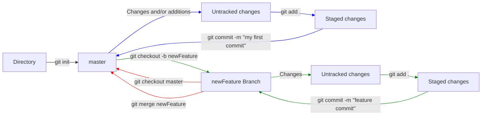
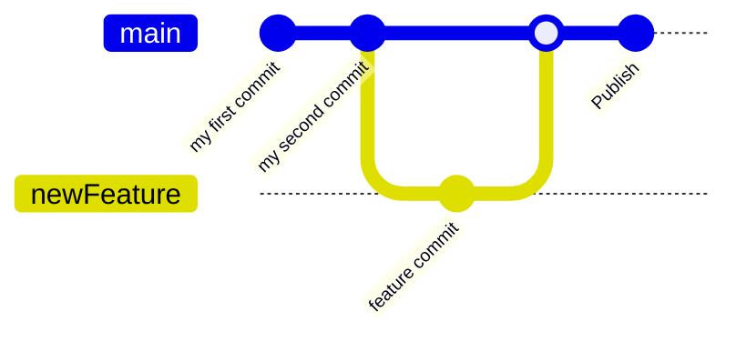

# Tutorial 3 - Source Control
Author: [Neil du Plessis](https://www.linkedin.com/in/neildup/)\
Last Edit: 2023/01/06

## Table of Content
- [Introduction to Git](#introduction-to-git)  
    - [Git Flow and Terms and Commands](#git-flow-and-terms-and-commands)
    - [Git Practice](#git-practice)
- [VSCode and Git](#vscode-and-git)
    - [Init](#init)
    - [Commit](#commit)
    - [Branch](#branch)
    - [Merge](#merge)
- [GitHub](#github)
    - [Master vs. Main](#master-vs-main)
    - [GitHub Practice](#github-practice)
- [Final Thoughts](#final-thoughts)

## Introduction to Git
Let's start by discussing version control.  
If you're not a developer, you  might have been doing version control using filenames, like so:

The problem with this approach is of course that you end up with lots of different copies of the file and no standard naming convention. If you try to work with others on this file it allows only serialised editing, meaning that if you've sent the file to someone else, you have to wait for them to complete before continuing on your own copy or else you're going to have to manually merge the content.

But why do we work on files like this?  Why save a new copy of the file regularly - it is to be able to **go back in time** in case we've accidentally deleted something or the like.

In the modern workplace using Microsoft 365 or Google Docs, this approach has been superseded by co-editing and automatic version history.  This means we can now save a file to OneDrive and the file is automatically saved as you type.  If you need to go back in time further than what a simple undo can allow, you can simply restore or save a copy of a previous version by right-clicking the file in OneDrive.  This effectively solves both problems of version control by filename stated above. 

Meanwhile, in the software development world, this same problem was solved many years ago by Git (version control) and more recently GitHub (co-editing).  Linux and Mac has Git preinstalled and you can install it for Windows.  The rest of the tutorial is going to be working in Windows.  

VSCode has built-in Git and GitHub support and there are extensions that expand these built-in capabilities.

Git and GitHub are completely different and separate, but integrated.  Git is a host-based version control system.  GitHub is an online Git repository system.  

Let's first become familiar with a few Git and GitHub terms, and then we'll look at a few examples.  

### Git Flow: Terms and Commands
*As a reminder, we're not using GitHub yet, just Git to preform version control on our local machine.* :wink:
- `git init`: This command will tell Git that the current directory should now be version controlled by Git.  You can also say `git init myProject1` which will create a subdirectory from the current path and start version-controlling it.  A hidden .git subdirectory will be created in the project directory that Git will use to store information related to your project.\
This also creates the default *branch* of the project called *master*.
- `git add .`: Any files you create in the project folder is considered temporary and untracked.  To get Git to track the file you use `git add <filename>`.  `git add .` tells Git to track all files in the project directory.  This is also called *staging* the files.
- `git commit -m "message"`: This command will *commit* all the staged files to the *master* branch.  At this point you can continue to make changes and/or add new files.  Stage them using `git add .` and commit them using `git commit -m "my commit description"`.  Make your commit messages descriptive so that if you need to go back in time you can do so without guessing which commit was for what.  
- `git log` shows you a log of all your commits in the current branch.  In this example, this will be for the *master* branch.  
- `git checkout <commitHash>` is used move around your commits (you get the commitHash from the Git log).  To get back to the latest commit, say `git checkout master`, assuming that you're still in the master branch.
- `git checkout -b newFeature`: At some point you will be satisfied with your project and want to preserve it in its current state - no more commits.  But you may still want to work on for example a new feature without effecting the master branch.  For this scenario you might want to create a new branch.  You can work on this branch, stage and commit changes until you're satisfied and want to merge your changes into the master branch.  
- `git checkout master`\
`git merge newFeature`:\
First we navigate back to the master branch and then we merge the newFeature branch into the master branch.  If the master branch had more commits since the newFeature branch was created, there might be conflicts that you have to resolve first, but in our example, we'll assume none such.  From this point, the master branch now contains all the changes and additions we made in the newFeature branch.  The newFeature branch will still be available or you might choose to delete the branch using `git branch -d new-branch`

Here's a diagram describing the above:


  \
You might see simplified versions of Git diagrams as follows:


### Git Practice
To get started with Git, we're first going to create install it and then configure a few basic settings.

- Install Git on your Windows computer from the PowerShell integrated terminal in VSCode, then restart VSCode.  

(If you're working on Mac or Linux you can skip this step.  However, this tutorial assumes that you're using Windows.)

**Note: Execute each of these lines of code individually from a PowerShell terminal.**
```PowerShell
# search for installable packages that contain the word 'Git'
winget search Git 
# review the results

# Install the official Git package
winget install -e --id Git.Git 
```
- Configure the basics:
```PowerShell
# Configure the username and email address for Git
# These are not credentials, they are simply used for author attribution
# It is also required for the VSCode Git integration to work
git config --global user.name "Your Name"
git config --global user.email "youremail@yourdomain.com"
```
- Create a new Git project and commit your first change:
```PowerShell
# Next, we'll initialise a Git project
git init project1
# This will create a subdirectory called project1
cd project1

# Make changes to the project (create a new file)
New-Item -Name file1.txt -ItemType File

# Stage all files
git add .

# To create a restore point
git commit -m "my first commit"

# Optional: Get list of commits
git log

# Optional: Go back in time to a previous commit in the current branch (you'll need more than one commit)
git checkout <hash_from_log>
```
- Create a new branch and switch to it:

```PowerShell
# Create a new branch and switch to it
git checkout -b newFeature

# Show the current branch
git branch --show-current

# Switch back to the master branch
git checkout master

# Swith to the newFeature branch (created earlier)
git checkout newFeature
```

At this point you can make changes or add more files, stage them, and commit them just like you did previously.  Finally, you may want to merge the newFeature branch back into master.  You can figure out how to do that.  Here's a hint:\
`git checkout master`\
`git merge newFeature`

- Check out further reading: [Git documentation](https://git-scm.com/doc).

## VSCode and Git
Now that we understand the basics of Git and since we're using VSCode in this course, you'll be very happy to learn that VSCode has Git built-in.  

(You still have to install Git on Windows if you haven't followed the instructions above.  Go back and do that at least before continuing here.) 

### Init
- Open a new VSCode window (no folder/workspace selected) by pressing Ctrl + Shift + N\
*Note: You may have configured VSCode to open a default workspace when launching.  You have to close that workspace and start fresh without a workspace to follow along.  To close a workspace say Ctrl + K F or say 'Close workspace' in the command palette (F1). Obviously, don't close the workspace you're reading this tutorial from.  Do the rest of the steps in this section in that new VSCode window.*
- Open a folder from the **Explorer** sidebar icon by clicking **Open Folder** - create a new folder somewhere on your local machine. Maybe something like *Git Example*. 
- Now, from the **Source Control** sidebar icon, select **Initialise Repository**.  
    - Notice that VSCode now shows the **master** branch on the bottom-left of the window. 
- Start the integrated (PowerShell) terminal by pressing Ctrl + \` and Say `Get-ChildItem -Hidden`. Notice the hidden *.git* directory.

### Commit
- Create a file by clicking *New File...* from the **Explorer** sidebar icon. Name it *file1.txt* (or whatever you want) and add some text to the file (and save it unless you have auto-save on.  *Btw, why don't you have this on?* :confused:)
    - Notice the **U** symbol that appears to the right of the file in the **Explorer**. This means that the file is untracked (un-staged) by Git.  
    - Also notice that **master** on the bottom left of the VSCode window now has a * to indicate changes are pending.
    - Also notice there is a pending changes indicator on the **Source Control** icon in the sidebar.  
- Open **Source Control** in the sidebar. 
- Stage the file by clicking **Stage Changes** or **Stage All Changes**
- Commit the changed file by writing a commit message above the **Commit** button and click **Commit**
    - Notice the * gone from master on the bottom-left and no more files on **Source Control**.  

### Branch
- Create a branch by clicking master (bottom-left).  This will open the command palette with the branch options available.
- Select **Create new branch...**.  It will ask for the branch name and enter something like *newFeature*. 
- You should still have *file1.txt* open, add some text to the file and save.
- Just like above, stage the changed file and commit with a message.

### Merge
- Checkout back to the master branch by clicking on newFeature (bottom-left) and selecting *master*. 
- Open the command palette (F1) and say merge - select **Git: Merge Branch...**.  Select *newFeature* as the branch to merge. 
- Lastly, let's get rid of the newFeature branch that we no longer need (since we merged the changes into master).  This is optional. From **Source Control** in the sidebar, from the ellipse menu select: Branch > Delete Branch... > newFeature.

Great! :dancer: 

**From now on, use Git source control when developing instead of a file-based approach when you're developing.**

## GitHub
GitHub is a web service that integrates with your local Git app as we've learned so far.  You can publish (push) your Git branches to GitHub to save it to the cloud. More importantly, pushing your code to GitHub allows you to share it with the world (or people of your choosing), especially if you want to work together on a coding project. 

Just like with Git, GitHub is already built-in to VSCode.  We're going to cover a few prerequisites and then publish the project we created in the previous practice to GitHub.  We'll then move on to a few other GitHub features that you're likely to use as part of starting out. 

### Master vs. Main
GitHub has decided to change the default name of the *master* branch to *main* for reasons of political correctness. 🙄  If you've been following the practice in this tutorial, your master branch will be called *master*, even when publishing it to GitHub.  If you create the repo on GitHub and then clone it to your local machine, it will be called *main*.  *main* is the default, but *master* is still allowed. We'll probably see this change continue to become the norm as we move forward. 

### GitHub Practice
- Open [GitHub](https://github.com) and sign-in, or create a new account and then sign-in. 
- In VSCode, from **Source Control**, click **Publish Branch**.  If it's your first time doing this, VSCode will ask you to sign-in to GitHub.  Select *Allow* and follow the prompts on the browser and back on VSCode.  
- VSCode will ask (in the Command palette) if you want to publish as a public or private repository.  You can choose private for now.\
This will kick off a process to create a repo on GitHub and push your files.

*Note: If VSCode seems to get stuck on uploading files (if not, skip these steps) the following fix is recommended:*
<details><summary>Fix stuck file upload</summary>

- Close and reopen VSCode
- Open the folder (workspace)
- From Command palette (F1) say *git remove remote* and select *origin*
- Open [GitHub](htps://github.com), and navigate to your repository.  It will have a list of instructions to push the branch to the GitHub via the terminal.  
- Follow the steps under *Connect an existing...* by pasting the commands in the integrated terminal.
- You will again be prompted to authenticate - say web browser and complete the authentication again.
- From now on the VSCode integration should work without fail.

*These steps will add **Git Credential Manager** to your GitHub authorised apps in addition to the **GitHub for VSCode Extension**.  This is what causes the file upload to not succeed the first time.*  

</details>

- Notice the sync icon next to the branch name (bottom-left).  If changes are pending, the icon will change to reflect this.  You can press the sync button to push your local changes to GitHub.  If changes are made to the repo in another way, pressing this button will update your local repo with the changes last pushed to the cloud. 
- Repeat the process described above to change the file, stage it, commit it, and this time add the additional step of syncing the GitHub library by clicking the sync button next to the branch name (bottom-left).

- Check out further reading: [GitHub documentation](https://docs.github.com/en).

## Final Thoughts
There are many more features and capabilities of Git and GitHub, but the ones discussed here will get you started.  There are a few more capabilities I'll list below that you should look into yourself.

- **Clone:** Cloning a repo from GitHub means that you download a repo from GitHub to your local machine.  You usually have only read-only permissions on these, but you can use the code in your own projects.  You can also clone your own repo if for some reason you lost access to the files on your local machine.
- **Fork:** You can create a copy of a GitHub repo you have access to (typically a public repo) as a repo onto your GitHub account.  You can then clone it down to your local machine to work on it as if it's your own.
- **Pull request:** If you're working on a forked repo, and want to suggest to the owner of the repo to consider adding your changes to his original you can create a pull request.  To do this from VSCode you might need an additional extension.  
- **Issue:** raising an issue on a repo in GitHub is like starting a discussion about a feature or functionality with the owner of the repo. 

You might see GitHub Flow diagrams for projects.  For example, we are using the following flow structure for this study group.

```mermaid
    gitGraph
        commit id:"final"
        branch fork/main
        checkout fork/main
        branch session1
        checkout session1
        commit
        commit
        checkout main
        merge session1 tag: "Pull Request" type: HIGHLIGHT
        commit
        checkout fork/main
        merge main tag: "Sync fork" type: HIGHLIGHT
        branch session2
        checkout session2
        commit
        commit
        checkout main
        merge session2 tag: "Pull Request" type: HIGHLIGHT
        commit
        checkout fork/main
        merge main tag: "Sync fork" type: HIGHLIGHT
        branch session3
        checkout session3
        commit
        commit
        checkout main
        merge session3 tag: "Pull Request" type: HIGHLIGHT
        checkout main
        commit
        checkout fork/main
        merge main tag: "Sync fork" type: HIGHLIGHT
```
### Well done! 🥇 

**In addition to using Git for version control, add GitHub for storing your code in the cloud from now on.**  

Later on, figure out how to share your code and work together with others on GitHub integrated to VSCode.  
